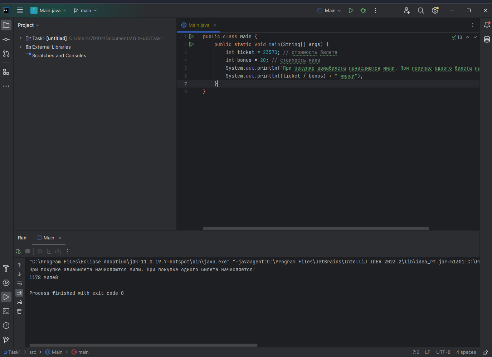

**<h2>Расчёт начисления милей при покупке авиабилетов</h2>**

**<h3>Описание</h3>**
При покупке авиабилета, за каждые 20 рублей стоимости билета.

**<h3>Шаги воспроизведения</h3>**

1. Открыть код программы в IDEA;
2. Выставить значение переменной ticket (стоимость билета) равной 23 570;
3. Выставить значение переменной bonus (стоимость мили) равной 20;
4. Запустить програму;
5. Посмотреть на вывод в консоли программы.

*Ожидаемый результат*: Вывод сообщения о рассчёте милей за покупку авиабилета стоимостью 23 570 условных денежных единиц.

*Фактический результат*: Вывод сообщения о рассчёте милей за покупку авиабилета стоимостью 23 570 условных денежных единиц.

**<h3>Скриншот</h3>**

**<h3>Окружение</h3>**

- **Операционная система**: Windows 11
- **IDE** IntelliJ IDEA 2023.2 
- **Java**: OpenJDK 11
